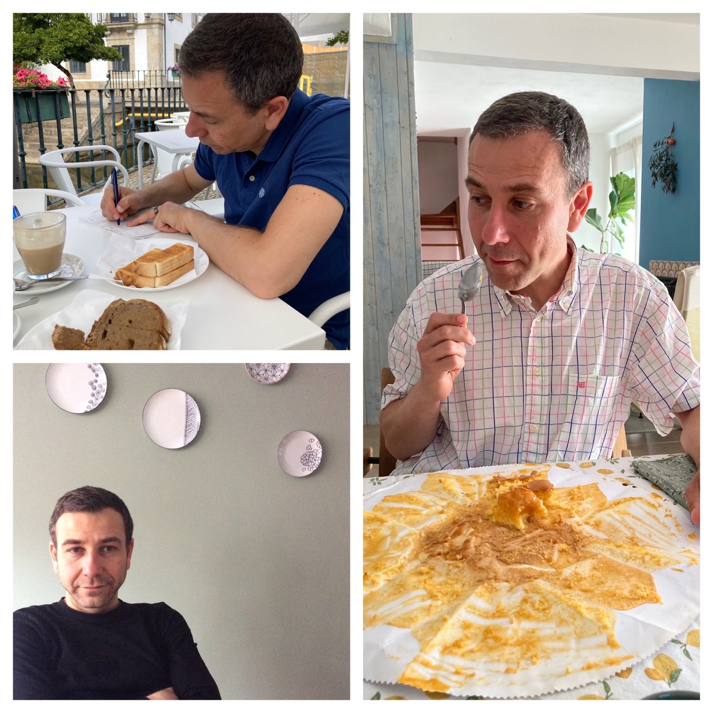

For the past twenty years, I have been employed in academia in five different countries, doing [research](research) in astronomy and astrophysics, and teaching mathematics, physics and astronomy.

I am a member of the [Institute of Astrophysics](http://iastro.pt/) in Portugal aince 2022, and work at [NL Space Campus](https://www.nlspacecampus.eu) in the Netherlands as scientific coordinator and with the [ESA Space Solutions](https://space.ipn.pt) team at Instituto Pedro Nunes in Coimbra. I am part of the [ESA Comet Interceptor](https://www.cometinterceptor.space) science working group.

## Education

- MSc in Physics, 2000, [Universidade de Lisboa](https://ciencias.ulisboa.pt/), Portugal
- PhD in Astrophysics, 2005, [Leiden University]([url](http://www.leidenuniv.nl/)http://www.leidenuniv.nl/), The Netherlands

## Recent Papers

- [Secular brightness curves of 272 comets](https://ui.adsabs.harvard.edu/abs/2025arXiv250400565L/abstract), Lacerda et al. 2025, accepted for publication at A&A.
- [How much earlier would LSST have discovered currently known long-period comets?]([url](https://ui.adsabs.harvard.edu/abs/2025Icar..42916443I/abstract)). Inno et al. 2025, Icarus 429, 116443.

## Short CV

- Scientific Programme Coordinator at [NL Space Campus](https://www.nlspacecampus.eu), 2024-now
- Member of the Comet Nucleus Science Working Group for the [ESA Comet Interceptor mission](https://www.cosmos.esa.int/web/comet-interceptor/home), 2023-now
- Member of the [Institute of Astrophysics and Space Sciences](http://www.iastro.pt/), 2022-now
- Technology Broker at [ESA Space Solutions Portugal](https://space.ipn.pt/), 2022-now
- Founder, Researcher, Teacher and Baker at [Miolo](https://miolo.nl/), 2020-2021
- Lecturer at [Queen’s University Belfast](http://www.qub.ac.uk/), UK, 2016-2019
- [Max Planck Research Group Leader](http://www.mpg.de/max_planck_research_groups), MPI for Solar System Research, Germany, 2013-2016
- Michael West Research Fellow, [Queen’s University Belfast](http://www.qub.ac.uk/), UK, 2010-2013
- [Royal Society Newton Fellow](http://royalsociety.org/grants/schemes/newton-international/), [Queen’s University Belfast](http://www.qub.ac.uk/), UK, 2008-2010
- Postdoc researcher, [Institute for Astronomy](http://www.ifa.hawaii.edu/), U. Hawaii, 2006-2008
- Postdoc researcher, [Coimbra University](http://www.uc.pt/fctuc/dmat), Portugal, 2005-2006
- PhD researcher, [Leiden University](https://www.universiteitleiden.nl/en/science/astronomy), Netherlands, 2000-2005
- Full CV linked [here](assets/pdfs/cv-2025.pdf).

## Other Info
- Here is a [list of my colleagues and collaborators](colleagues).
- ORCID iD: [0000-0002-1708-4656](https://orcid.org/0000-0002-1708-4656)
- Ciência ID: [601F-21C5-E180](https://www.cienciavitae.pt/portal/601F-21C5-E180)
- [Homepage](http://staff.uc.pt/uc47883) at Coimbra University

<!-- Note: Our house in Portugal is for sale. [Check the photos and other info here](house-for-sale). -->
