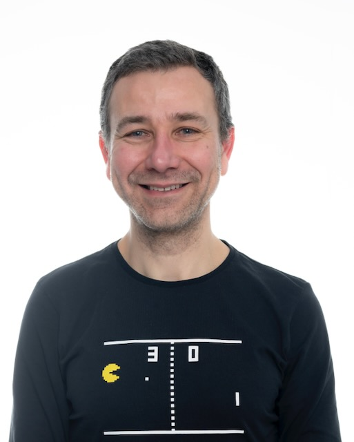

For the past twenty years, I have been employed in academia in five different countries, doing [research](research) in astronomy and astrophysics, and teaching mathematics, physics and astronomy.

Since 2022, I am a member of the Institute of Astrophysics in Portugal, and work with the ESA Space Solutions team at Instituto Pedro Nunes in Coimbra. I am part of the ESA Comet Interceptor science working group.

## Education

- MSc in Physics, 2000, [Universidade de Lisboa](https://ciencias.ulisboa.pt/), Portugal
- PhD in Astrophysics, 2005, [Leiden University]([url](http://www.leidenuniv.nl/)http://www.leidenuniv.nl/), The Netherlands

## Short CV

- Member of the Comet Nucleus Science Working Group for the [ESA Comet Interceptor mission](https://www.cosmos.esa.int/web/comet-interceptor/home), 2023-now
- Member of the [Institute of Astrophysics and Space Sciences](http://www.iastro.pt/), 2022-now
- Technology Broker at [ESA Space Solutions Portugal](https://space.ipn.pt/), 2022-now
- Founder, Researcher, Teacher and Baker at [Miolo](https://miolo.nl/), 2020-2021
- Lecturer at [Queen’s University Belfast](http://www.qub.ac.uk/), UK, 2016-2019
- [Max Planck Research Group Leader](http://www.mpg.de/max_planck_research_groups), MPI for Solar System Research, Germany, 2013-2016
- Michael West Research Fellow, [Queen’s University Belfast](http://www.qub.ac.uk/), UK, 2010-2013
- [Royal Society Newton Fellow](http://royalsociety.org/grants/schemes/newton-international/), [Queen’s University Belfast](http://www.qub.ac.uk/), UK, 2008-2010
- Postdoc researcher, [Institute for Astronomy](http://www.ifa.hawaii.edu/), U. Hawaii, 2006-2008
- Postdoc researcher, [Coimbra University](http://www.uc.pt/fctuc/dmat), Portugal, 2005-2006
- PhD researcher, [Leiden University](https://www.universiteitleiden.nl/en/science/astronomy), Netherlands, 2000-2005

Here is a [list of my colleagues and collaborators](colleagues).

Note: my homepage is slowly migrating from [https://lacerdapedro.wordpress.com](https://lacerdapedro.wordpress.com) to here.
