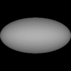
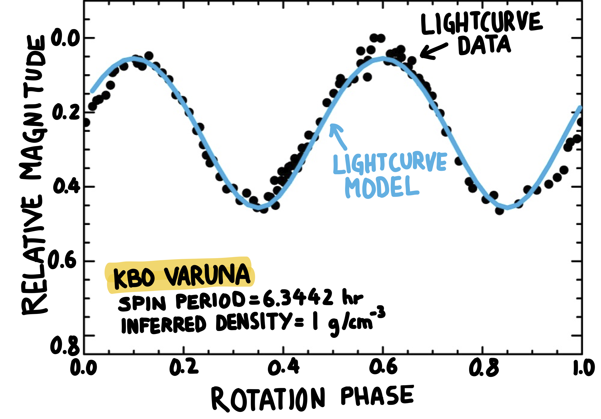

# Density

The density of an object is its mass per unit volume. Water has a density of 1 gram per cubic centimeter (g/cm³ for short). The density is a material property that measures how "heavy" material is for a given volume. For instance, an bottle cork is lighter than a rock of the same size, so the rock is denser than cork.

Different materials have different densities, so we can use density to guess what an object is made of on the inside, without having to cut through it. Here's a video explaining density and telling the story of how [Archimedes figured out if his king's crown was made of gold](http://video.mit.edu/watch/is-that-really-gold-archimedes-and-density-10968/). 

In the solar system, we are interested in figuring out the density of different objects to find out what they are made of. For example, we expect the rocky asteroids to have densities near 3 g/cm³ (because they are rocky) and the comets to have densities around 1 g/cm³ because they are made of ice. So, how do we measure the density of objects in the solar system? Well, in an indirect way.

## Why Planets Are Round

In general, the [lightcurve](lightcurves-of-small-solar-system-bodies) of an object tells us both how fast [it spins](the-rotational-properties-of-kuiper-belt-objects) and [how](the-shapes-of-kuiper-belt-objects) [elongated it is](the-shapes-of-kuiper-belt-objects). We can use this information to infer how "strong" an object is. The word strong is in quotes because the strength can have different origins.

For small bodies, up to about 100 kilometers across, their material strength is responsible for holding their shapes. This is true for much smaller bodies as well. A stone, for instance, keeps its shape because of material strength, and we can reshape it by breaking or sculpting it, or maybe by heating it to very, very high temperatures until it melts. But the stone will not reshape itself.

But for much bigger objects, their gravitational potential is so large that it reshapes the object by crunching it into a sphere. This is the case with the Earth and the other terrestrial planets. The gravity of the Earth is so strong that if you try to build a mountain much larger than the Everest it would crumble under its own weight.

The exact size at which a body can crush itself into a sphere is not very well know and it depends on what the object is made of (rock, metal, ice, etc.). But for a mix of ice and rock that size is probably between 20 and 200 km.

## Hydrostatic Equilibrium

 

If the object is in hydrostatic equilibrium its density and spin period will define its shape. By measuring the spin period and approximate shape from the lightcurve we are able to estimate the  density.

But are all objects larger than 200 km perfectly spherical? No. Not even the Earth, more than 6000 km in radius is a perfect sphere. Because of the Earth's rotation, its shape is slightly oblate meaning that the equatorial radius is larger than the polar radius. The Earth balances approximately the  internal pressure, the acceleration due to gravity, and the  acceleration due to rotation. An object for which these three  effects balance is said to be in hydrostatic equilibrium, and its density and spin rate define its shape. If the Earth were to  spin faster, say at 20 hours per rotation instead of 24, it would be even more oblate. And if we kept spinning up the Earth, at some point its shape could even change into a triaxial ellipsoid (a more egg-like figure); its exact shape — more or less elongated — would depend almost exclusively on its spin rate and density[^1]. A denser body will be "stronger" in resisting deformation and it will remain more spherical at the same spin rate than a less dense body. If the Earth were made of ice, instead of 5 g/cm³ it would have a density closer to 1 g/cm³ and its shape would be even more deformed towards oblate.

Figure 1 — Observed (+'s) and model (solid line) lightcurves, and rotating shape model for Kuiper belt object Varuna. The derived density based on the shape model and spin period (P = 6.3442 hr) is approximately ρ = 1 g/cm\^3.

Figure 2 — Observed (•'s) and model (solid line) lightcurves, and rotating shape model for Kuiper belt object Varuna. The derived density based on the shape model and spin period (P = 6.3442 hr) is approximately ρ = 1 g/cm³.

This is where the [lightcurves](lightcurves-of-small-solar-system-bodies) come into action. By telling us how fast an object spins and how elongated it is, a lightcurve allows us to estimate the object's bulk density. Density is one of the hardest properties to measure remotely, but it is a good indicator of the bulk composition of an object. Rocky objects will have densities close to 3 g/cm³ while icy objects will be closer to 1 g/cm³. In the last couple of years I have developed a computer model that generates lightcurves for arbitrary ellipsoidal shapes. I use that program to find the shape that best fits observed lightcurves and then use the objects rotation period and shape to calculate its approximate bulk density. You can find the paper that describes the procedure in more detail [here](http://goo.gl/wAhCI).

[^1]: in reality this is only true for fluids, but for very large bodies the approximation turns out to be good.
