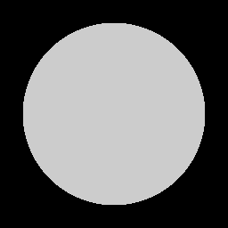
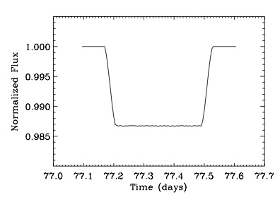
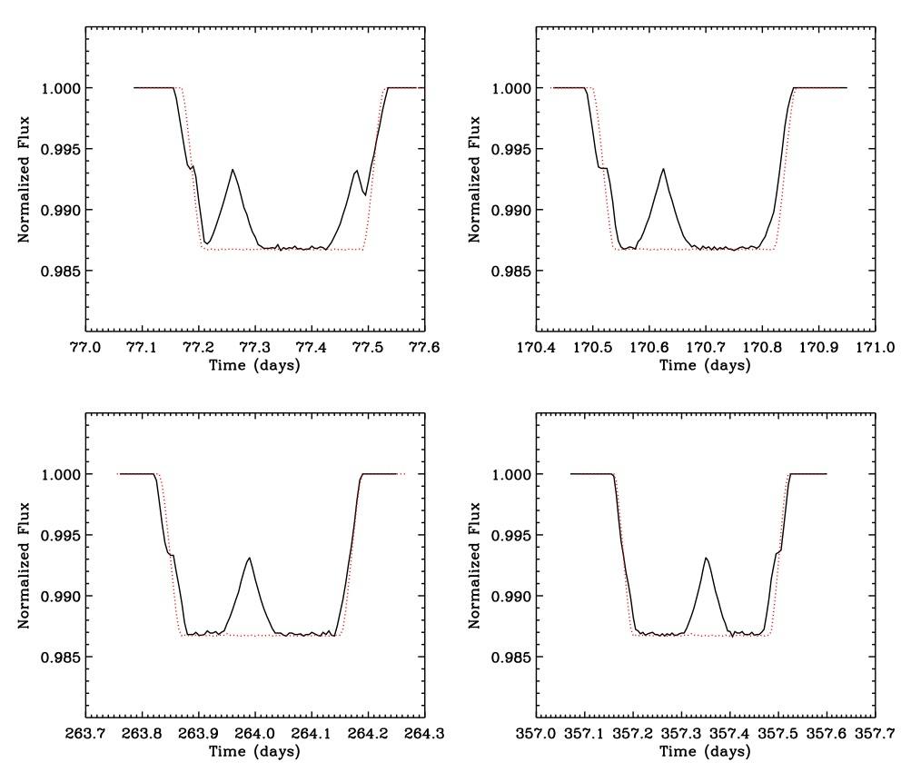
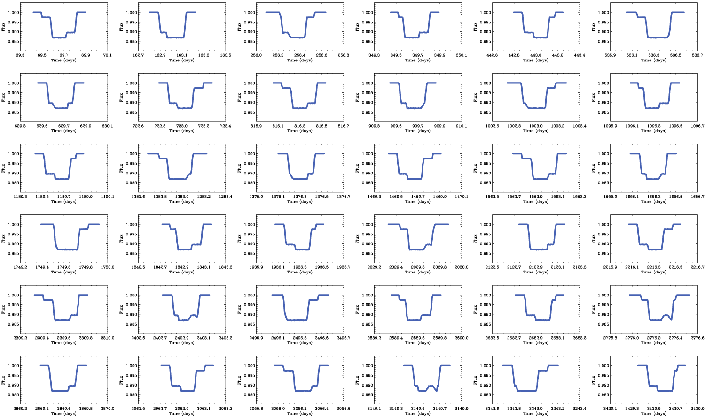
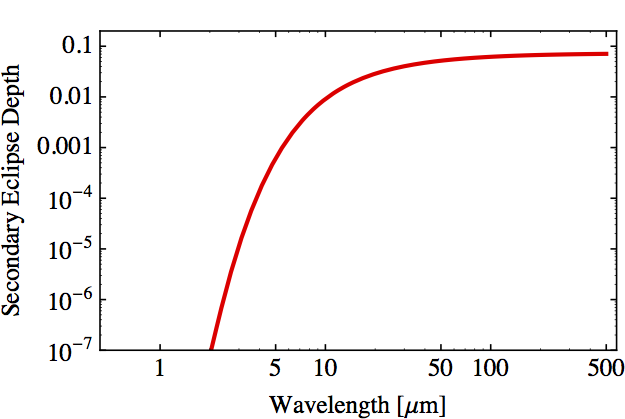
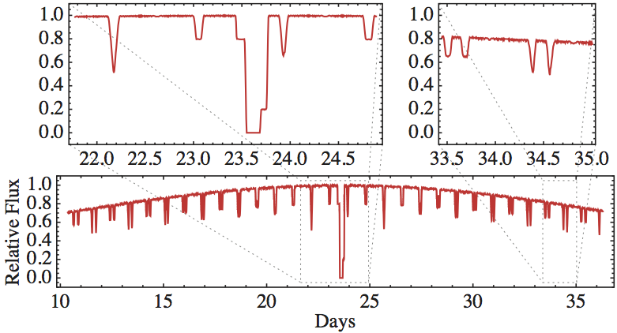

# Exobinaries

I am interested in the possibility of finding binary exoplanets. In the final phases of planet formation several planetary cores should coexist and interact dynamically, which could lead to the formation of pairs. If some of these pairs have survived we may be able to detect them using transit photometry. The easiest to detect would be systems with nearly *equal sized components*, or **exobinaries**.

Here, I report on what the transit lightcurve of a binary exoplanet would look like. I simulate the orbit of the exobinary around a star using an N-body code (mercury6, [Chambers 1999](https://tinyurl.com/5v9oz8y)), then extract the transit part and render it using the ray-tracing technique used in [Lacerda & Jewitt 2007](https://www.doi.org/10.48550/arXiv.astro-ph/0612237).

## Corot-9b

First let's look at a simulation of a single exoplanet. I will use [Corot-9b](https://exoplanets.org/cgi-bin/planet.py/CoRoT-9_b) for this exercise. Corot-9b has a \~95 day orbit around G3 V star of mass 1 Msun. I assumed the star has a radius 1 Rsun.

So, the planet above is modelled on Corot-9b which has the following physical parameters:

| Quantity     | Symbol | Value         |
| ------------ | ------ | ------------- |
| Mass         | M      | 0.84 Mjupiter |
| Radius       | R      | 1.05 Rjupiter |
| Bulk Density | Rho    | 0.9 g/cc      |

Assuming no stellar limb-darkening, the transit lightcurve of this synthetic Corot 9b looks as follows:

## Exobinary

Now I will simulate a symmetric exobinary based on Corot-9b. I assume the binary has the same total mass and maximum cross-section as the single planet. So, each of the two identical components should have the following physical parameters:

| Quantity     | Symbol   | Value                       |
| ------------ | -------- | --------------------------- |
| Mass         | M_exob   | M/2 = 0.42 Mjupiter         |
| Radius       | R_exob   | R/Sqrt\[2\] = 0.74 Rjupiter |
| Bulk Density | Rho_exob | Sqrt\[2\]\*Rho = 1.27 g/cc  |

where M, R and Rho are the values above for Corot-9b. I use a binary separation of 0.05 Hill radii.

I computed four consecutive orbits of the exobinary using the N-body code mercury6 and extracted the transits. Here is an animation of those 4 transits.

The lightcurves of the 4 consecutive transits are shown below. The red, dotted line shows the transit lightcurve of Corot 9b, for comparison, and the solid black line is the lightcurve of the exobinary.

## Different sized components

Here is a [simulation](https://www.youtube.com/watch?v=28PWhf1XXLw) of 36 consecutive transits from a system where the exobinary components have a mass ratio of 8 and are separated by 0.1 mutual Hill radii. Watch the movie at [this link](https://www.youtube.com/watch?v=28PWhf1XXLw).
<!-- \[youtube http://www.youtube.com/watch?v=28PWhf1XXLw\] -->

The 36 transit lightcurves look like this:

## Exobinary detection using the secondary transit and mutual shadowing

Another way to detect exobinaries is to look for mutual eclipses. The secondary transit and exobinary mutual eclipses will be significantly easier to detect in the far-infrared, e.g. using ALMA, where the stellar flux becomes relatively less important.

The observed abundance of these systems can be used to test planet formation models. If we detect such systems in the future, the mutual binary shadowing will reveal the cooling and heating of exoplanet surfaces and atmospheres. An interesting prospect is that eclipsing exobinaries can be detected even if the system does not transit the host star. This significantly increases the number of exoplanet systems that can be uncovered from our vantage point.

A model of an exobinary mutual-eclipses lightcurve is shown below. A dip occurs every time one of the binary components eclipses or shadows the other. The large dip in brightness in the middle occurs when the exobinary passes behind the host star. The overall curvature of the lightcurve is due to the illumination phase, the same effect Galileo observed for Venus more than 300 years ago.

Here is a [simulation](https://youtu.be/28PWhf1XXLw) of an exobinary. The [movie](https://youtu.be/28PWhf1XXLw) follows the eclipsing binary system for half an orbit as it passes behind the star. The star illuminates the exobinary but is shown as a black, invisible sphere (this is clear halfway through the movie when the binary passes behind the star).

<!-- <iframe width="560" height="315" src="https://www.youtube.com/embed/28PWhf1XXLw" title="YouTube video player" frameborder="0" allow="accelerometer; autoplay; clipboard-write; encrypted-media; gyroscope; picture-in-picture; web-share" allowfullscreen></iframe> -->

<!-- [youtube](https://youtu.be/28PWhf1XXLw) -->

Follow [this link](http://api.soundcloud.com/tracks/41578691) for a [sonification](http://en.wikipedia.org/wiki/Sonification) attempt for the data used to generate the exobinary video above.

<!-- \[soundcloud url="http://api.soundcloud.com/tracks/41578691" params="" width=" 100%" height="166" iframe="true" /\] -->
