# Lovely house for sale in a quiet village in central Portugal

<!-- 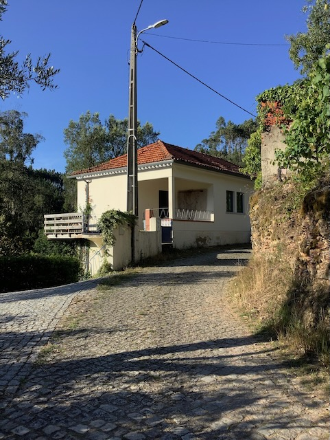 -->

[Link naar Nederlandse beschrijving.](#beschrijving-in-het-nederlands) | [Link naar foto's.](#photos) | [Link naar plattegrond.](#floorplan-plattegrond)

---

##  Description in English

[Link to photos.](#photos) | [Link to floorplan.](#floorplan-plattegrond)

We are selling our lovely house in central Portugal. It is located in a
    small village between the thermal town of Luso and Mortágua. It is a
    beautiful, quiet place with great views over the green hills.

The house was completely renovated in 2019 with double glazing
    throughout.

Downstairs is a large open space with kitchen. The room remains wonderfully cool in summer. Two sets of double patio doors open up to the garden. There is also a toilet where the washing machine is located, with a connection for a shower, should this be desired in the future.

The kitchen has a large fridge-freezer, a gas cooker and large oven. Hot water comes from a gas boiler that works with a gas cylinder. Above the sink is a large tilting window overlooking the garden.

During the winter, the house is heated with the fireplace and the heating system connected to it: a hot water tank above the fireplace distributes hot water to radiators throughout the house. Wood can be bought from the neighbour, who delivers it to the house - you can pile it under the stairs outside.

Upstairs, there are two large bedrooms, one of which we use as a workspace (there is fibre-optic internet, works great), and a small room that fits a single bed. There is a bathroom with a spacious shower and two French windows with a view. There is also space in the hall for things like shelves and/or a small table.

The energy label is A - the certificate dates from 2022.

A veranda wraps around the back and side of the house, where you can enjoy a cup of coffee in the morning and listen to the birds. Everything around you is green! You don't hear any traffic; a car passes by maybe three times a day. At night it is dead quiet, you won't hear dogs barking, just the crickets, frogs and owls.

Next to the house is an open shed with shelving units.

The garden is about 750 m2 and has several olive trees (you can harvest the olives and take them to the press and then enjoy your own olive oil!), an apple tree, lemon tree, fig tree, strawberry trees (medronheiros) and grape vines. We made our own small vegetable garden, where we grew tomatoes, courgettes, peppers, various cabbages, broccoli, lettuce and cucumbers. 

The village has no café or shops. Two or three times a week the baker drives by, on Tuesdays a fish truck and on Wednesday afternoons a mobile mini market with all sorts of supplies. The sweet and helpful Portuguese villagers regularly leave bags of fruit and vegetables on your doorstep and constantly invite you for a glass of wine (which they make themselves!). A two-minute walk away is a holiday villa with pool owned by a Dutch couple, part of which is rented out to mainly Dutch tourists. Handy for when you don't want/can't have guests in your own house.

We can give you the contact details of the builder who renovated the house, should you want to make any changes. He speaks English.

Luso, which is famous for its water, and Mortágua, where all sorts of events are organised in the summer and where there are several supermarkets, are 10 to 15 minutes' drive away. There are also waterfalls nearby and a large dam/reservoir where you can swim. You can also enjoy hiking in/around the village on the numerous paths that lead everywhere.

The old university city of Coimbra is a 45-minute drive away and the beach is an hour's drive. Porto airport is an hour and a half away. You can also get to Salamanca (Spain) in just three hours.

### Frequently Asked Questions 

#### Why are you selling the house?

Because Pedro will start working in the Netherlands from 1 January, so we will be living in the Netherlands all over again.

#### Is there water on the property?

There is no well or electricity on the property, but there are invisible streams in the village, from which several residents tap to irrigate their pieces of land.
We collect rainwater through a gutter on the shed - the water ends up in a barrel and with it we water the garden.

#### Is there sewerage or a septic tank?

There is a septic tank that needs no further action - you don't have to worry about it.

#### How far are you from the forest?

The forest is literally all around you, you are on a path among the trees within two minutes.

#### Does the house have a residential licence?

Yes, it is an ordinary residential house where you can live without any problem.

#### Are there any schools nearby?

Unfortunately, we don't know, as we don't have any children of our own and no children live here in the village.

#### Do Portuguese people speak English?

In general, Portuguese do speak some English, especially the younger generation. The older people here in the village do not speak English, only French. There are countless foreigners living in Portugal who don't speak a word of Portuguese and still get everything done, so language need not be a barrier. But if you want really nice contact with people, you would do well to learn some Portuguese. And with a glass of wine, communication will be a lot smoother! ;-)

---

## Beschrijving in het Nederlands

Te koop: heel fijn huis in een rustig dorpje in Centraal Portugal.

Wij verkopen ons mooie huis in het midden van Portugal. Het ligt in een klein dorpje tussen het thermenoord Luso en Mortágua. Het is een prachtige, rustige plek met een geweldig uitzicht over de groene heuvels. 

Het huis is in 2019 geheel gerenoveerd met overal dubbele beglazing.  Beneden is een grote open ruimte met keuken. Hier blijft het in de zomer heerlijk koel. Er zijn twee sets dubbele openslaande deuren. Ook is er een toilet waar de wasmachine staat, met een aansluiting voor een douche, mocht dit in de toekomst wenselijk zijn. 

De keuken heeft een grote koelkast met vriezer, een gasfornuis en grote oven. Warm water komt van een gasboiler die met een gasfles werkt. Boven de gootsteen zit een groot kiepraam met uitzicht op de tuin. 

Het huis wordt in de winter verwarmd met de haard en het verwarmingssysteem dat daaraan zit gekoppeld: een warmwaterreservoir boven de haard verspreidt het warme water naar de radiatoren in het huis. Hout kun je kopen van de buurman, die het aan huis levert - je kunt het onder de trap buiten opstapelen. 

Boven zijn er twee grote slaapkamers, waarvan wij er één als werkruimte gebruiken (er is glasvezel internet, werkt uitstekend), en een klein kamertje waar een eenpersoonsbed in past. Ook is er een badkamer met een ruime douche en twee openslaande ramen met uitzicht. In de hal is er ook ruimte voor zaken als een kast en een tafeltje. 

Het energielabel is A, het certificaat dateert uit 2022. 

Aan de achterkant en zijkant van het huis loopt een veranda, waar je 's ochtends van een kopje koffie kunt genieten en naar de vogels kunt luisteren. Alles om je heen is groen! Je hoort geen verkeer, er komt misschien drie keer per dag een auto voorbij. 's Nachts is het doodstil, je hoort geen geblaf van honden, alleen de krekels, kikkers en uiltjes. 

Naast het huis is een open schuur met stellingkasten. 

De tuin is ongeveer 700 m2 en heeft diverse olijfbomen (je kunt de olijven oogsten en naar de pers brengen en dan kun je van je eigen olie genieten!), een appelboom, citroenboom, vijgenboom, aardbeibomen (medronheiros) en druivenranken. Wij hebben zelf een klein moestuintje gemaakt, waar we tomaten, courgettes, paprika's, diverse kolen, broccoli, sla en komkommers hebben gekweekt. 

Het dorpje heeft geen café of winkeltjes. Twee of drie keer per week komt de bakker langs, op dinsdag een viskar en op woensdagmiddag een SRV-wagen met van alles en nog wat. De lieve en behulpzame Portugese dorpsbewoners leggen regelmatig zakken met groente en fruit voor de deur en nodigen je voortdurend uit voor een glaasje wijn (die ze zelf maken!). Op twee minuten lopen ligt een vakantievilla met zwembad van een Nederlands stel, waarvan een deel wordt verhuurd aan voornamelijk Nederlandse toeristen. Handig voor als je geen gasten in je eigen huis wilt/kunt hebben. 

We kunnen je de contactgegevens geven van de aannemer die het huis heeft verbouwd, mocht je er nog wat aan willen veranderen. Hij spreekt Engels.

Luso, dat bekendstaat om zijn water, en Mortágua, waar in de zomer van alles wordt georganiseerd en waar diverse supermarkten zijn, liggen op 10 à 15 minuten rijden. Verder zijn er watervallen in de buurt en een stuwmeer waar je kunt zwemmen. Ook kun je in/rond het dorp heerlijk wandelen op de talloze paden die overal heen leiden. Er zijn hier nooit bosbranden geweest.

De oude universiteitsstad Coimbra ligt op 45 minuten rijden en het strand is een uur rijden. Het vliegveld van Porto ligt op anderhalf uur. Ook kun je in slechts drie uur naar Salamanca. 

### Veelgestelde Vragen 

#### Waarom verkopen jullie het huis?

Omdat Pedro vanaf 1 januari in Nederland gaat werken en we dus weer helemaal in Nederland gaan wonen.

#### Is er water op het terrein?

Er is geen put of stroom op het terrein, maar in het dorp zijn er wel onzichtbare stroompjes, waar diverse bewoners van tappen om hun stukjes land te irrigeren.
Wij vangen regenwater op via een goot op het schuurtje - het water belandt in een vat en daarmee bewateren wij de tuin.

#### Is er riolering of een septic tank?

Er is een septic tank die verder geen actie behoeft - je hebt er geen omkijken naar.

#### Hoe ver ben je van het bos?

Het bos is letterlijk om je heen, je staat binnen twee minuten op een pad tussen de bomen.

#### Heeft het huis een woonvergunning?

Ja, het is een gewoon woonhuis waar je probleemloos kunt wonen.

#### Zijn er scholen in de buurt?

Helaas weten we dat niet, omdat we zelf geen kinderen hebben en er hier in het dorp ook geen kinderen wonen.

#### Spreken Portugezen Engels?

Over het algemeen spreken Portugezen wel wat Engels, zeker de jongere generatie. De oudere mensen hier in het dorp spreken geen Engels, wel Frans. Er wonen talloze buitenlanders in Portugal die geen woord Portugees spreken en toch alles gedaan krijgen, dus de taal hoeft geen barrière te zijn. Maar als je echt leuk contact met de mensen wilt, doe je er goed aan wat Portugees te leren. En met een wijntje erbij verloopt de communicatie al een stuk vlotter! ;-)

---

## Photos

### Surroundings/Omgeving

<video width="500px" controls="controls" src="figs/2023/08/huis-azival-00009.mov"></video>
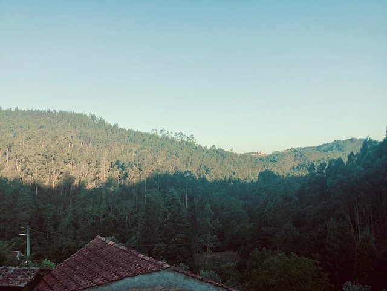

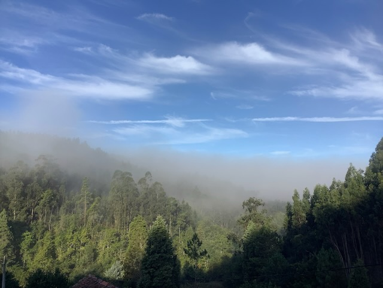

### Garden/Tuin

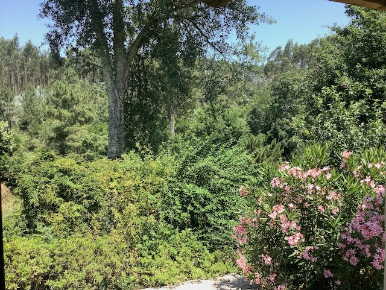

### Outdoors/Buiten

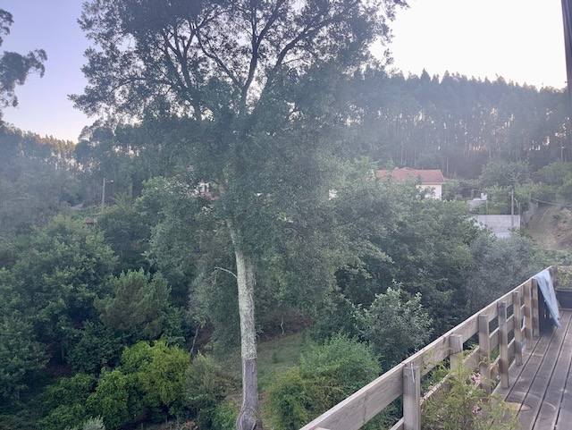
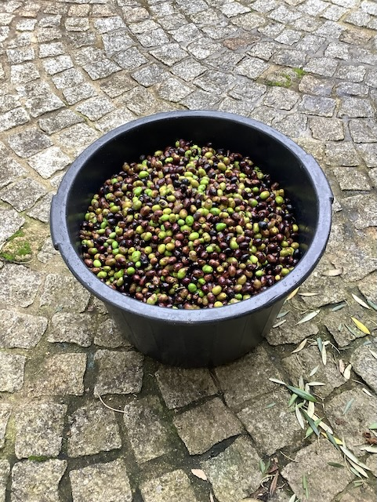
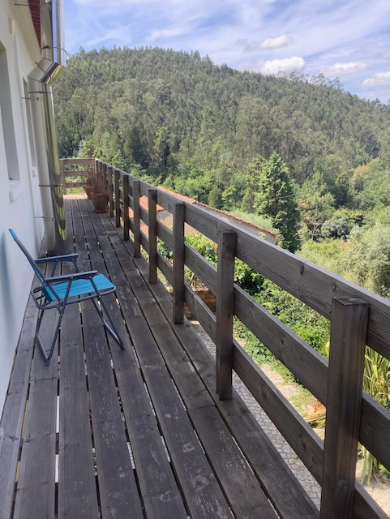

### Indoors/Binnen

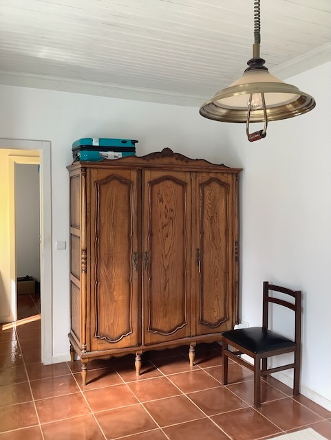
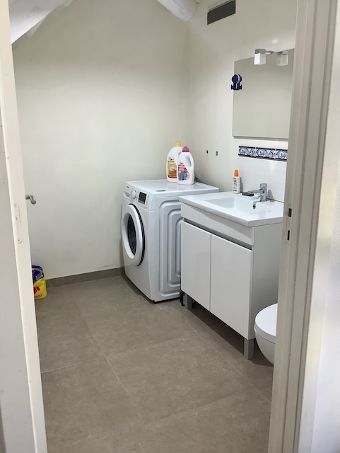

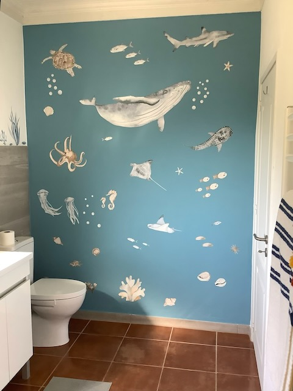

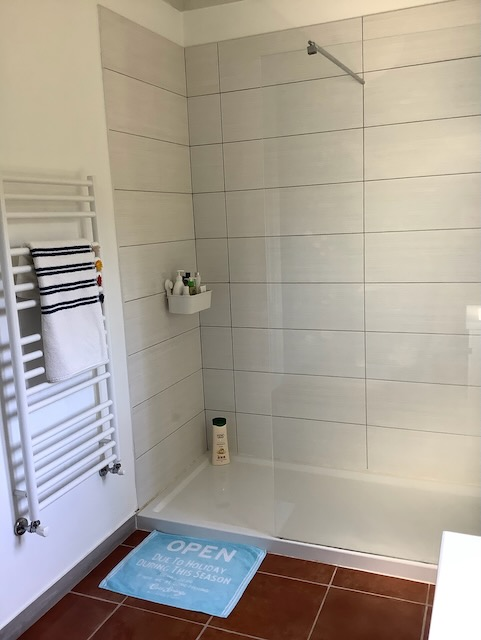
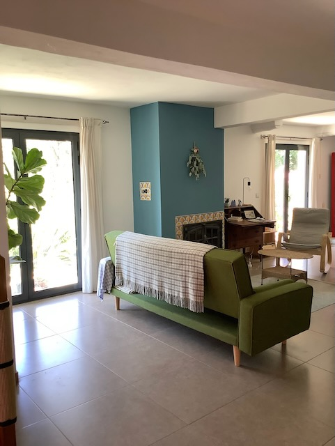
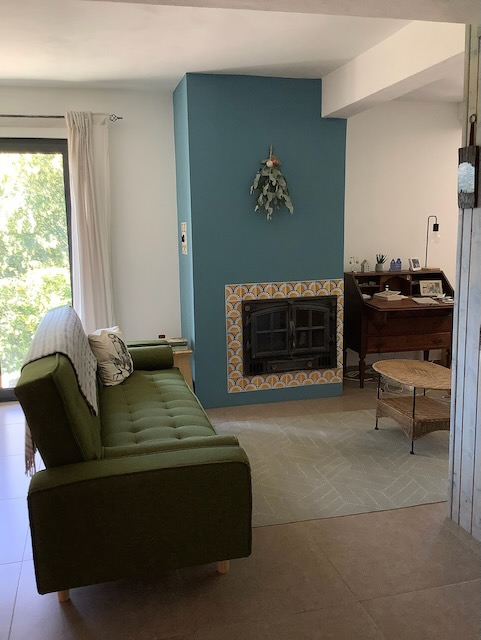

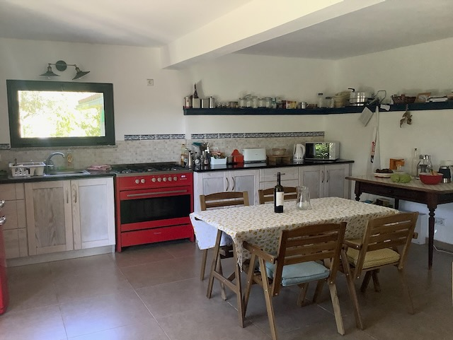

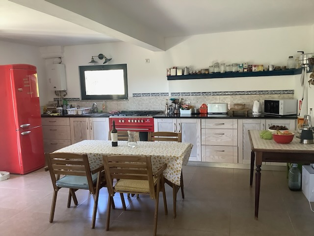

### Floorplan Plattegrond

