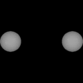

# Lightcurves of small solar system bodies

## What is a lightcurve?

A non-spherical^[^1] body rotating in free space will reflect more or less sunlight depending on which side is facing the observer. An elongated object will reflect more light from its larger flank-side than from its smaller tip-side. The lightcurve is the brightness variation as a function of time. In general, the lightcurve is periodic (period is the spin period of the body) and its range of variation will depend on how elongated the body is.

 

A spherical object can also produce a lightcurve if its surface is spotty. If some portions of the surface have a higher albedo (reflect more light) than others then the apparent brightness of the object will increase or decrease depending on which portion we happen to be looking at. Consider, for example, a sphere painted half white half black. If we spin it so that we see the white and the black hemispheres alternately, we will see a lightcurve.

[^1]: or with no rotational symmetry.

## Types of lightcurves

Different systems produce different lightcurves. One of the main distinguishing features is the total range of brightness variation (plotted on the vertical axis). [Contact binaries](binaries) produce the largest variation, while albedo patches on a spherical object generally produce the shallowest lightcurves. Lightcurves cause by shape have two minima and two maxima per full rotation (one full phase) and are usually very regular and symmetric. The ones due to albedo have more irregular morphologies and only show one minimum and one maximum for every rotation.

## What can we learn about small bodies using lightcurves?

A lightcurve of a small body tells us its [rotation period](the-rotational-properties-of-kuiper-belt-objects), in other words, how fast is it spinning. In general, lightcurves are caused by the body's [elongated shape](the-shapes-of-kuiper-belt-objects). This means that the lightcurve goes through 2 maxima and 2 minima in one full rotation of the body. The spin period is thus the time difference between repetitions of one of the 2 maxima.

The brightness range of the lightcurve tells us about [how elongated is the body](the-shapes-of-kuiper-belt-objects). As the examples depicted here show, a more elongated object like a [contact binary](binaries) (which is actually cheating because a contact binary are two objects) produces a much larger range than the single ellipsoid at the top. The morphology (shape) of the lightcurve is also different from system to system and we can use that different to guess how the object looks like. Remember that the objects we observe are so far that we can only see them as a dot of light. We cannot tell the shape, or if these are single or binary objects. They all look like dots.

Besides the [rotation period](the-rotational-properties-of-kuiper-belt-objects) and [shape of an object](the-shapes-of-kuiper-belt-objects), a lightcurve can also tell us about a body's [density](density).

## Relevant publications

Here are a few papers I wrote that use lightcurves to study solar system objects:

-   [Lacerda & Luu, 2003. On the detectability of lightcurves of Kuiper belt objects. Icarus 161, 174.](https://ui.adsabs.harvard.edu/#abs/2003Icar..161..174L/abstract)
-   [Lacerda & Luu, 2006. Analysis of the Rotational Properties of Kuiper Belt Objects. The Astronomical Journal 131, 2314.](https://ui.adsabs.harvard.edu/#abs/2006AJ....131.2314L/abstract)
-   [Lacerda & Jewitt, 2007. Densities of Solar System Objects from Their Rotational Light Curves. The Astronomical Journal, 133, 1393.](https://ui.adsabs.harvard.edu/#abs/2007AJ....133.1393L/abstract)
-   [Lacerda, 2008. Detection of Contact Binaries Using Sparse High Phase Angle Light Curves. The Astrophysical Journal Letters, 672, 57.](https://ui.adsabs.harvard.edu/#abs/2008ApJ...672L..57L/abstract)
-   [Lacerda 2011. A Change in the Light Curve of Kuiper Belt Contact Binary (139775) 2001 QG298. The Astronomical Journal, 142, 90.](https://ui.adsabs.harvard.edu/#abs/2011AJ....142...90L/abstract)
-   [Lacerda, McNeill & Peixinho 2013. The Unusual Kuiper Belt Object 2003 SQ317. MNRAS, 142, 90.](https://ui.adsabs.harvard.edu/#abs/2014MNRAS.437.3824L/abstract)

<!-- \* or with no rotational symmetry. -->

Pedro Lacerda, May 2021

