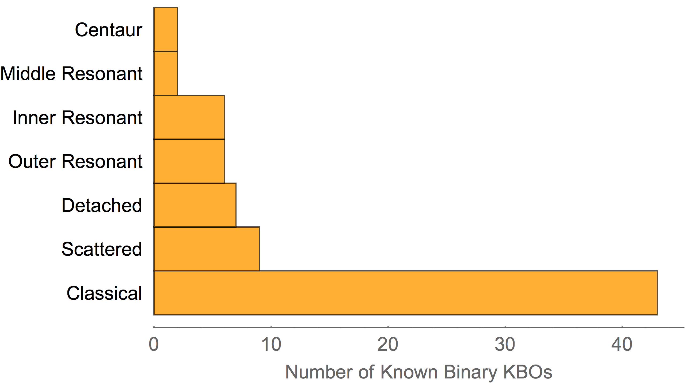
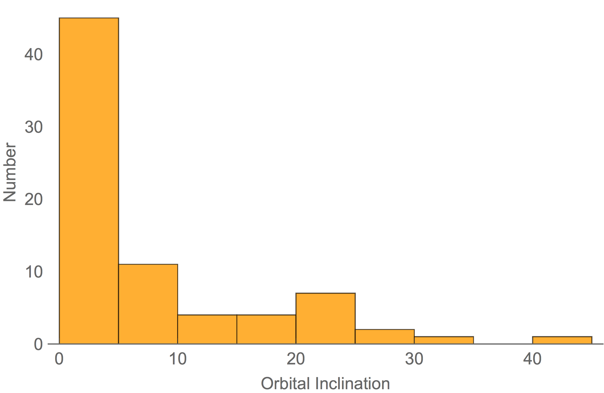
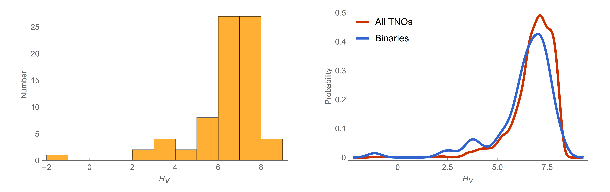
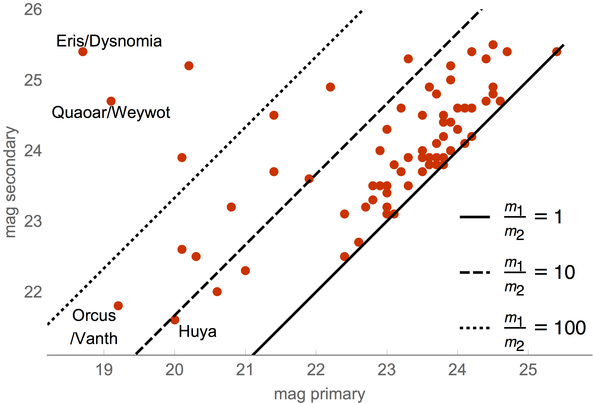
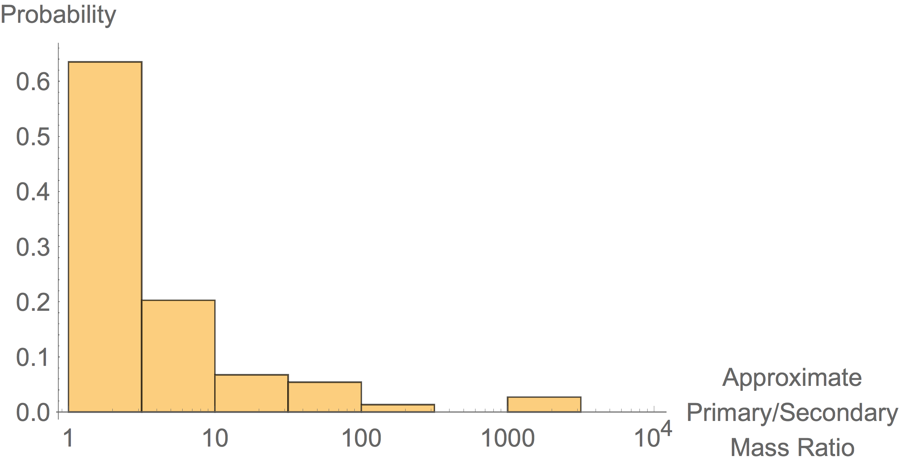

# Resolved Binaries

More than 70 Kuiper belt objects (KBOs) and Centaurs have been identified as resolved binary objects. [Resolved](angular-resolution) binaries are objects where you can see, or resolve, the two components orbiting each other. Extrapolating from the number of known binaries we believe that something between 5% and 25% of all KBOs are binaries. This is a very large fraction.

The other type of KBO binaries which seems equally (or more) abundant is [contact binaries](binaries). Those are identified from their [lightcurves](lightcurves-of-small-solar-system-bodies).

The main conclusions on resolved KBO binaries from the plots below are:

-   Most binaries are Cold Classical KBOs, i.e., KBOs located in the Classical region, between 39 AU and 47 AU, and with low orbital inclinations, below 5 degrees.
-   Binaries have an absolute magnitude distribution similar to the overall KBO population. This would naively imply that binaries do not prefer a particular size of KBO.
-   However, binaries prefer to have similar size/mass components. Roughly 80% of known KBO binaries have mass ratios less than 10. That means that the primary is mostly up to twice the size of the secondary.
-   KBO binaries tend to be very compact. The smaller the separation, the larger the number of binaries.

Below I show a number of plots that use data from [Will Grundy's Binary TNOs page](http://www2.lowell.edu/~grundy/tnbs/).

## Number of binaries per dynamical class in the Kuiper belt

First, let us look at the known binaries by dynamical family. Most binaries exist in the Classical KBO population. This has been known for some time ([Stephens & Noll 2006](http://labs.adsabs.harvard.edu/adsabs/abs/2006AJ....131.1142S/)).

## Heliocentric inclination of KBO binaries

If we now plot the orbital inclination distribution of the binaries we find that most binaries are located at low inclinations ([Noll et al. 2008](http://labs.adsabs.harvard.edu/adsabs/abs/2008Icar..194..758N/)).

## Absolute magnitude of KBO binaries

The absolute magnitude of binaries is clustered around 6\<Hv\<8. However, it is not incompatible with the Hv distribution of KBOs as a whole. In conclusion, binaries do not pick a particular absolute magnitude - they exist at all brightnesses.

## Relative brightness and mass of the binary components

The two components in each binary tend to have similar magnitudes. This is true even accounting for observational biases.

As seen above, binaries cluster at mass ratios close to 1, meaning that the two components of each binary tend to have similar masses. The masses were calculated assuming that the components have the same density and albedo.

## Binary separation

The binary separation (semi-major axis of the binary orbit) statistics indicates that there are more compact binaries than very distant ones. The spatial resolution of the surveys looking for binaries become the limiting factor in detecting more and more compact binaries. Binaries more compact than about 100 milliarcsec angular separation are probably hard to detect, even with the Hubble Space Telescope.

Pedro Lacerda, June 2015