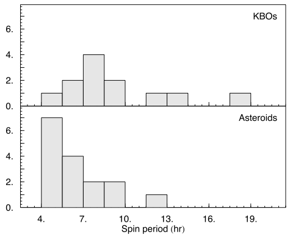

# The Rotational Properties of Kuiper Belt Objects

## What are Kuiper Belt objects?

Kuiper Belt objects (usually designated KBOs) are large blocks of ice mixed with dirt which orbit the Sun 30 to 50 times further than the Earth. They can be a few to a few thousand kilometers in diameter. Their orbits make up a ring beyond the orbit of planet Neptune, so they are sometimes called trans-Neptunian objects. The KBOs are believed to be leftovers from the formation of the planets. The outer giant planets of the Solar System all have icy cores surrounded by layers of gas. The KBOs are probably pieces that were not used to form those cores. Studying the KBOs is important because, among other things, they carry information about the past, when the Solar System was forming, and potentially about unreachable places, such as the cores of the giant planets. Much more information about Kuiper Belt objects can be found on [David Jewitt's webpage](colleagues).

## What are Rotational Properties?

KBOs spin. We know that because some of them have [lightcurves](lightcurves-of-small-solar-system-bodies). Rotational properties is what we call the two main properties that can be measured from a lightcurve: the period and the range of variation. The period of the lightcurve tells us how fast the KBO is spinning, and the range of variation will depend on [how elongated or aspherical that same KBO is](the-shapes-of-kuiper-belt-objects). See [this page](lightcurves-of-small-solar-system-bodies) for more information on lightcurves.

## What do we know about the Rotational Properties of KBOs?

Rotational properties have been measured for about 50 KBOs. Although this number is still small when compared to the more than one thousand lightcurves measure for asteroids, it is already enough to allow us to investigate some overall trends. The figure below is a histogram showing the distribution of KBO and asteroid spin periods, i.e. how many objects spin with a given period.

## Why is this important?

The distribution of spin rates of a family of objects can tell us, for instance, how often have they collided with each other. In principle, the more collisions the faster the spins of the objects. The asteroids have a distribution of spins which is mostly set by mutual collisions. We find that KBOs spin slower on average than asteroids (see Figure on the right). Whereas most large asteroids spin once every 4 to 6 hours, similar sized KBOs complete a rotation in about 7 to 9 hours.

The spin rates of KBOs can also indirectly tell us how dense they are, or [how strong is the material they are made of](density). Large KBOs, larger than maybe 200 km in diameter, are held together mainly by self-gravity which dominates in comparison to the material strength. If a large KBO spins very fast then it must be dense to be able to hold on to its own material by self-gravity. Smaller KBOs, for which self-gravity is less important than material strength need to be stronger the faster they spin otherwise they would fly apart.

The largest KBOs (over 500 km in diameter) have almost certainly preserved the spins they had when they formed. The reason is that they have not collided with anything big enough to change their spin because there are very few of these largest bodies and they are very far apart. The implication is that the rotational properties of the largest KBOs can constrain our models of planet formation; they take us to the time of planet formation and tell us how fast thing were spinning then.

## Relevant publications

-   [Lacerda & Luu, 2003. On the detectability of lightcurves of Kuiper belt objects. Icarus 161, 174.](http://labs.adsabs.harvard.edu/ui/abs/2003Icar..161..174L)
-   [Lacerda & Luu, 2006. Analysis of the Rotational Properties of Kuiper Belt Objects. The Astronomical Journal 131, 2314.](http://labs.adsabs.harvard.edu/ui/abs/2006AJ....131.2314L)
