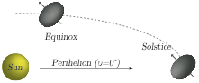

### Main Belt Comets

|  |
| :-------------------------: |
|          Figure 1           |

Main belt comets (MBCs) are a recently identified class of objects that have asteroid orbits but, like comets, exhibit dust comae and tails driven by ice sublimation. MBCs are significant because they tell us the asteroid belt holds not only rocky asteroids but also icy objects which may have delivered water to Earth after it formed. For the ice to have survived so close to the Sun for the age of the solar system it must be thermally insulated by a dusty mantle. The leading idea to explain the observed activity is that occasional impacts by `~ 1` m-sized objects excavate the mantle and expose the ice. When the exposed ice patch heats up by insolation it begins to sublimate and to drive the ejection of dust into a coma and tail. The activity would then be seasonal, occurring during summertime for the hemisphere containing exposed ice.

### 133P/Elst-Pizarro and the Seasonal Hypothesis

The first and best studied MBC is 133P/Elst-Pizarro. 133P is known to be active for 1⁄4 of its orbit, roughly starting at perihelion. If the activation mechanism described above and the seasonal hypothesis are correct, then the patch of ice driving the activity on 133P must be on the hemisphere that preferentially faces the Sun during that part of the orbit. Summer solstice must lie close to perihelion (see Figure 1), or slightly past it. Plus, the obliquity, ε, must be non-zero.

|  |
| :-------------------------------: |
|             Figure 2              |

### Photometric range as a test for the Seasonal Hypothesis

The photometric range (∆m) of an object is minimum at solstice as the spin axis is most aligned with the Sun direction, and maximum at equinox when the object is observed equator-on. Figure 1 shows the case when solstice happens at perihelion – this is the scenario predicted by the seasonal hypothesis. Lightcurves of 133P taken at perihelion (Jul 2007) and `~70` deg past it (Sep 2002) are shown in Figure 2. Each dataset was phased self-consistently to spin period `P=3.947(1)` hr but the two epochs are just aligned by eye as the period uncertainty propagated for 5 years becomes too large. In Figure 2a the alignment is such that ∆m does not seem to have changed much from 2002 to 2007. In Figure 2b, ∆m seems to have decreased from `∆m_2002 ~ 0.36` mag to `∆m_2007 ~ 0.25` mag. The ambiguity is important because it has implications for the pole orientation of 133P and for testing the seasonal hypothesis.

|  |
| :-------------------------------: |
|             Figure 3              |

### Lightcurve models of 133P

In Figure 3 we show 3D models of the nucleus of 133P and respective lightcurves in 2002 and 2007 assuming 3 different pole solutions. For obliquity `ε = 20` deg, three solstice positions are shown, at mean anomalies `ν_sol = 0` deg, `40` deg and `90` deg. A more detailed comparison of the `∆m` behaviour predicted for each pole orientation is shown in Figure 4. For solstice at perihelion (`ν_sol = 0` deg, Figure 4a) the range `∆m` should remain unchanged for low obliquity `0 < ε < 10` deg or decrease for obliquities `ε > 10` deg. This is consistent with what is observed for 133P (Figure 1). For solstice at `ν_sol = 90` deg (Figure 4c) `∆m` is expected to remain unchanged from 2002 to 2007 if `0 < ε < 10` deg but it should rise if `ε > 10` deg – this is not observed in the data. An intermediate case (`ν_sol = 40` deg, Figure 4b) shows that we are not sensitive to the exact position of the pole – more data is needed, at different points along the orbit.

|  |
| :-------------------------------: |
|             Figure 4              |

### Conclusions

Lightcurve data taken in Sep 2002 and Jul 2007 are used to test the seasonal hypothesis for the activity pattern of MBC 133P. The data are consistent with the seasonal hypothesis and rule out solstice at mean anomaly νsol=90 deg. The data do not rule out zero obliquity – observations at different geometries are needed for that purpose.

### Essential MBC reading

-   [Hsieh et al. (2004.AJ.127.2997)](https://ui.adsabs.harvard.edu/abs/2004AJ....127.2997H/abstract)
-   [Hsieh & Jewitt (2006.Sci.312.561)](https://ui.adsabs.harvard.edu/abs/2006Sci...312..561H/abstract)
-   [Hsieh et al. (2009.AJ.137.157)](https://ui.adsabs.harvard.edu/abs/2009AJ....137..157H/abstract)
-   [Jewitt et al. (2009.AJ.137.4313)](https://ui.adsabs.harvard.edu/abs/2009AJ....137.4313J/abstract)
-   [Hsieh (2009.A&A.505.1297)](https://ui.adsabs.harvard.edu/abs/2009A%26A...505.1297H/abstract)

Pedro Lacerda, April 2013.