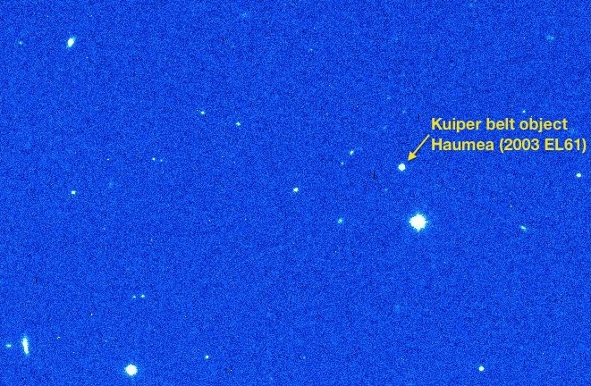
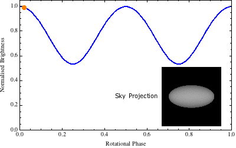
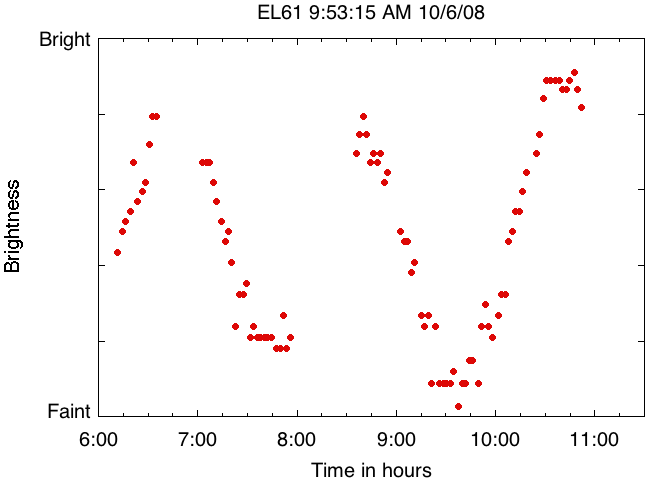

# The Shapes of Kuiper Belt Objects

## We cannot see the shapes of Kuiper Belt Objects

Kuiper Belt objects (KBOs) are too far for us to be able to resolve their shapes — they appear point-like, just like stars. If their shapes cannot be measured directly then we must infer them from other things we can measure.

If a KBO is not spherical, then its appearance in the sky will change as it spins. This change in appearance translates into a periodic change in brightness. This brightness oscillation is called a lightcurve. So, if an object produces a lightcurve, we already know something about it's shape: it is probably not spherical. The less spherical, or more elongated an object is, the larger will be the lightcurve range of variation.

About 35% of the KBOs searched for lightcurves show significant brightness variation. This fact alone can be used to rule out the possibility that all KBOs are spherical. Here is the observed lightcurve of KBO Haumea (previously known as 2003EL61).

 
