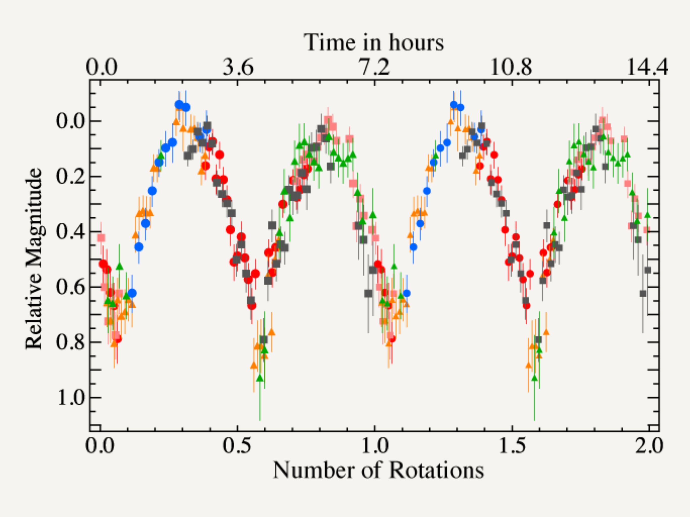
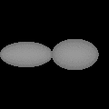
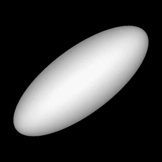
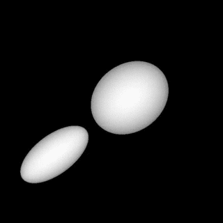

2003 SQ317 is a strange Kuiper belt object. Over time, its brightness oscillates greatly, more than doubling in intensity every 3.6 hours. What happens is that SQ317 has an elongated shape and as it spins it alternates between a smaller tip-on and a larger sideways appearance, reflecting corresponding amounts of sunlight. On the magnitude scale, SQ317 varies by about 0.9 units.

<!-- \[caption id="attachment_1174" align="aligncenter" width="400"\]{.aligncenter .size-medium .wp-image-1174 width="400" height="300"} Lightcurve of KBO 2003 SQ317.\[/caption\] -->
{:width="400px"} Lightcurve of KBO 2003 SQ317

<!-- \[caption id="attachment_449" align="alignleft" width="120"\][{.size-full .wp-image-449 width="120" height="120"}](http://lacerdapedro.files.wordpress.com/2013/11/qg982fitduo0-21077.gif) Model of contact binary 2001 QG298.\[/caption\] -->
{:width="120px"} Model of contact binary 2001 QG298.

A brightness variation as large as that of SQ317 is very unusual. Only one other KBO varies more than SQ317: the contact binary [2001 QG298](extreme-and-extremely-tilted-kbo/ "Extreme and Extremely Tilted KBO"), which has a variation of 1.2 magnitudes. In the case of QG298, its two components are tidally stretched due to their mutual gravitational pull giving the object an extremely elongated shape. Could the same be the case for SQ317?

The size of SQ317 is not known exactly, but it is probably larger than 300 km along its longest axis. When a large, elongated object spins in free space, its configuration is affected by mainly 3 forces: gravity, pulling the surface inwards, pressure, holding the pull of gravity, and centrifugal forces, where the tips of the object want to go off in a straight line and tend to stretch the elongated shape even further.

If we assume that the shape of the object is set by a balance between those three forces — that balance is called hydrostatic equilibrium — then there is a limit to how elongated the object can be before with splits into pieces (the tips fly off). QG298 is more elongated than the limit, so it is only stable as a binary. SQ317 is right at the threshold and can be both a single object or a binary. Here are the two possible models. Click the images to see them spin.

<!-- \[caption id="attachment_475" align="alignright" width="150"\][{.size-thumbnail .wp-image-475 width="150" height="150"}](http://lacerdapedro.files.wordpress.com/2013/11/2003sq317_ellipsoid.gif) Jacobi ellipsoid model of 2003 SQ317.\[/caption\] -->

<!-- \[caption id="attachment_474" align="alignnone" width="150"\][{.size-thumbnail .wp-image-474 width="150" height="150"}](http://lacerdapedro.files.wordpress.com/2013/11/2003sq317_binary.gif) Roche binary model of 2003 SQ317.\[/caption\] -->
{:width="150px"}Jacobi ellipsoid model of 2003 SQ317.
{:width="150px"} Roche binary model of 2003 SQ317.

Both models fit the lightcurve data reasonably well, although the binary model does slightly better at matching the faintest points. However, the two models predict very different [bulk densities](density "Density") for SQ317. While the single, elongated ellipsoid model implies a density near 1 grams per cubic centimetre, which implies an icy composition, the binary model requires a bulk density over 2.5 g/cc which would mean a much rockier composition for SQ317.

Observations by [Snodgrass et al. 2010 (A&A 511, A72)](http://labs.adsabs.harvard.edu/adsabs/abs/2010A&A...511A..72S?) suggest that SQ317 may be a chunk of ice that flew off the large [KBO Haumea](http://lacerdapedro.wordpress.com/the-dark-red-spot-on-dwarf-planet-haumea/ "The Dark Red Spot on Dwarf Planet Haumea") as a result of a massive collision. If that is the case, SQ317 is expected to be composed mainly of water-ice, and a density near 1 g/cc would make sense. If it turns out that SQ317 is essentially rocky this would raise questions about its origin and make things interesting. Future observations in the next decade or two may help decide which of the two models above is closer to the truth.

The scientific paper describing this discovery will appear soon in the MNRAS journal ([DOI link](http://dx.doi.org/10.1093/mnras/stt2180)). A preprint PDF can be found here: [Lacerda, McNeill & Peixinho (2013)](https://arxiv.org/pdf/1309.1671v1.pdf).

Other related publications:

-   [**Lacerda 2011.** [A Change in the Light Curve of Kuiper Belt Contact Binary (139775) 2001 QG298.](http://goo.gl/P1NG5) The Astronomical Journal, 142, 90. ([ADS link](http://labs.adsabs.harvard.edu/adsabs/abs/2011AJ....142...90L/))]{style="line-height:1.5;"}
-   **Lacerda 2009.**[ [Time-Resolved Near-Infrared Photometry of Extreme Kuiper Belt Object Haumea.](http://goo.gl/gUzzs) The Astronomical Journal 137, 3404. ([ADS link](http://labs.adsabs.harvard.edu/adsabs/abs/2009AJ....137.3404L/))]{style="line-height:1.5;"}
-   **Lacerda**[, Jewitt, & Peixinho ]{style="line-height:1.5;"}**2008.**[ [High Precision Photometry of Extreme KBO 2003 EL61.](http://goo.gl/ecG1U)The Astronomical Journal 135, 1749. ([ADS link](http://labs.adsabs.harvard.edu/adsabs/abs/2008AJ....135.1749L/))]{style="line-height:1.5;"}
-   [**Lacerda** & Jewitt **2007**. [Densities of Solar System Objects from Their Rotational Light Curves.](http://goo.gl/wAhCI) The Astronomical Journal, 133, 1393. ([ADS link](http://labs.adsabs.harvard.edu/adsabs/abs/2007AJ....133.1393L/))]{style="line-height:1.5;"}

This work was partly funded by the [Royal Society](https://royalsociety.org) through a [Newton Fellowship](http://newtonfellowships.org).
